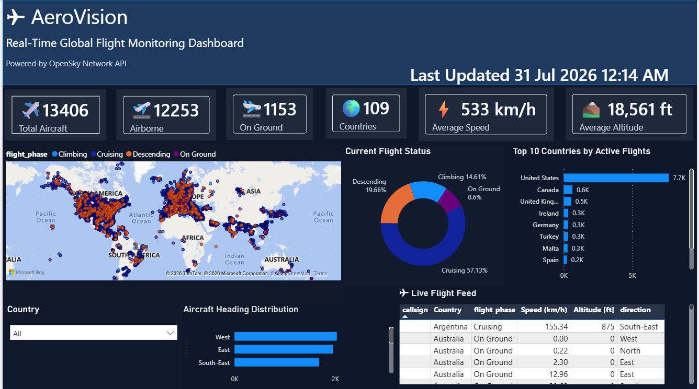
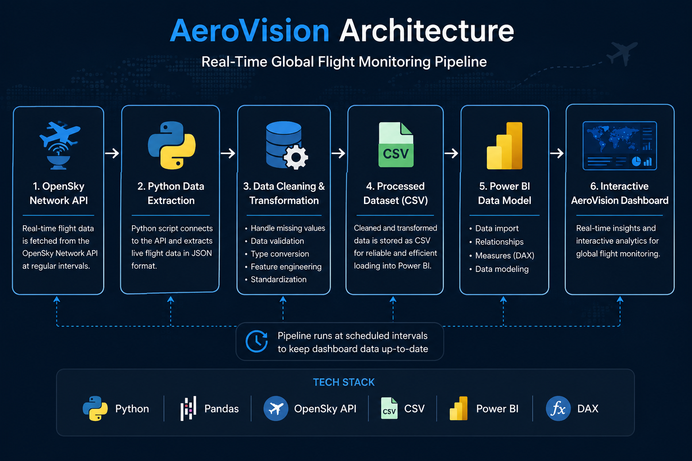
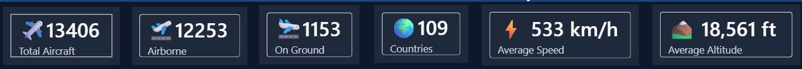
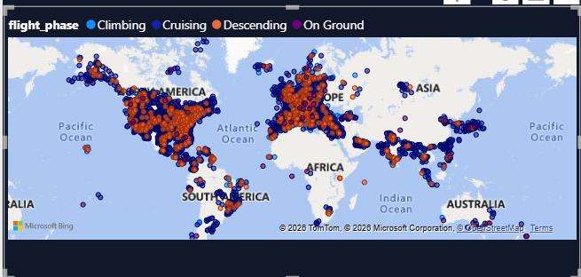
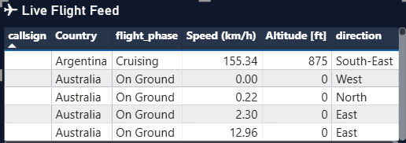

# ✈️ AeroVision


## Real-Time Global Flight Monitoring Dashboard

AeroVision is an end-to-end **real-time aviation analytics project** that monitors live aircraft worldwide using the **OpenSky Network API**, processes the data through a Python ETL pipeline, and visualizes actionable insights using an interactive **Power BI dashboard**.

The project demonstrates real-time data ingestion, automated data processing, feature engineering, and business intelligence reporting.

---

# 🏠 Dashboard Overview



---

# 📖 Project Overview

AeroVision was built to simulate an aviation operations dashboard capable of monitoring thousands of aircraft in real time.

The system periodically fetches live flight information from the OpenSky Network API, cleans and transforms the data using Python, stores the processed dataset, and presents interactive analytics through Power BI.

The dashboard enables users to monitor:

- 🌍 Live aircraft across the globe
- ✈️ Airborne vs On-Ground aircraft
- ⚡ Average flight speed
- ⛰️ Average flight altitude
- 🌎 Country-wise aircraft activity
- 🧭 Aircraft heading distribution
- 📋 Live flight feed with interactive filtering

---

# 🚀 Features

- Real-time flight monitoring
- Automated Python ETL pipeline
- Interactive Power BI dashboard
- Global aircraft visualization
- Dynamic KPI cards
- Country-based filtering
- Flight phase analysis
- Aircraft heading distribution
- Live flight feed
- Automatic dashboard refresh after data update

---

# 🏗️ System Architecture



---

# 📊 Dashboard Screenshots

## KPI Overview



---

## Live Global Flight Map



---

## Live Flight Feed



---

# ⚙️ Technology Stack

| Category | Technologies |
|-----------|--------------|
| Programming | Python |
| Data Processing | Pandas, NumPy |
| API | OpenSky Network API |
| Visualization | Power BI |
| Data Modeling | DAX |
| Data Storage | CSV |
| IDE | VS Code |

---

# 🔄 Data Pipeline

```text
OpenSky Network API
        │
        ▼
Python ETL Pipeline
(Fetch → Clean → Transform)
        │
        ▼
Processed Flight Dataset (CSV)
        │
        ▼
Power BI Data Model
        │
        ▼
Interactive Dashboard
```

---

# 📈 Key Dashboard Metrics

- Total Aircraft
- Airborne Flights
- On-Ground Flights
- Active Countries
- Average Flight Speed
- Average Flight Altitude

---

# 🎯 Interactive Dashboard Components

- 🌍 Global Aircraft Position Map
- 📊 Current Flight Status Distribution
- 🌎 Top Countries by Active Flights
- 🧭 Aircraft Heading Distribution
- 📋 Live Flight Feed
- 🌐 Country Filter

---

# 📂 Project Structure

```
AeroVision/
│
├── assets/
│   ├── home.png
│   ├── kpi.png
│   ├── map.png
│   ├── flightdata.png
│   └── architecture-diagram.png
│
├── data/
│   ├── raw/
│   └── processed/
│
├── docs/
│
├── scripts/
│   ├── auth.py
│   ├── fetch_data.py
│   ├── clean_data.py
│   ├── feature_engineering.py
│   ├── eda.py
│
├── main.py
├── powerbi_source.py
├── requirements.txt
├── .env.example
└── README.md
```

---

# ▶️ Getting Started

## Clone Repository

```bash
git clone https://github.com/manish-jc/AeroVision.git
```

---

## Install Dependencies

```bash
pip install -r requirements.txt
```

---

## Configure Environment Variables

Create a `.env` file and add your OpenSky API credentials.

```text
OPENSKY_USERNAME=your_username
OPENSKY_PASSWORD=your_password
```

---

## Run ETL Pipeline

```bash
python main.py
```

---

## Open Dashboard

Open the Power BI dashboard and refresh the dataset to visualize the latest flight information.

---

# 💡 Future Improvements

- Airline-wise analytics
- Airport traffic monitoring
- Historical flight trend analysis
- Weather integration
- Flight delay prediction
- Scheduled cloud deployment
- Real-time streaming using Kafka
- Azure/AWS data pipeline integration

---

# 👨‍💻 Author

**Manish J C**

M.Sc. Data Analytics

GitHub: https://github.com/manish-jc

LinkedIn: www.linkedin.com/in/jc-manish


---

# ⭐ If you found this project interesting, consider giving it a star!
